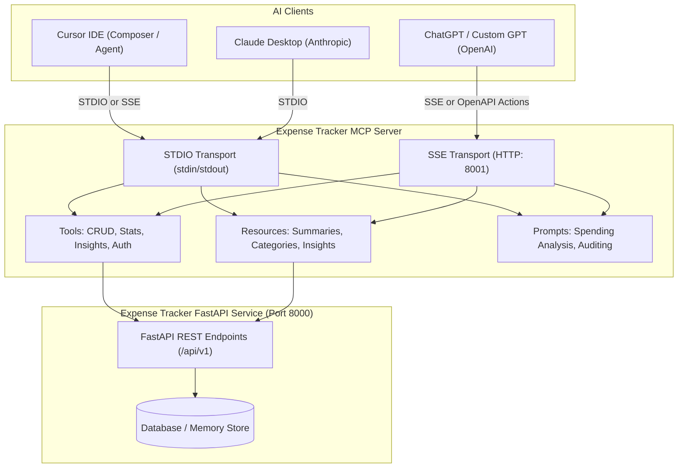

# Expense Tracker MCP Server Integrator Guide

This guide provides step-by-step instructions to integrate the **Expense Tracker MCP (Model Context Protocol) Server** with **Cursor IDE**, **Claude Desktop / Claude Code**, and **ChatGPT (Custom GPTs / Actions)**.

---

## 1. Overview & Architecture

The Expense Tracker MCP Server exposes the full expense management lifecycle and financial intelligence engine to AI models through the standard **Model Context Protocol (MCP)**.



### Supported Transports:
- **STDIO Mode** (Default): Used by **Cursor IDE** and **Claude Desktop** via process spawning.
- **SSE / HTTP Mode** (`--transport sse` on port `8001`): Used by **ChatGPT Custom GPT Actions**, remote agents, or browser-based AI interfaces.

---

## 2. Server Installation & Build

### Prerequisites
- **Node.js**: v18.0.0 or higher (v20+ recommended)
- **FastAPI Backend**: Running on `http://127.0.0.1:8000` (or configured URL)

### Build Steps

```bash
# Navigate to mcp-server directory
cd EXP-TRACKER/mcp-server

# Install dependencies
npm install

# Build TypeScript to JavaScript
npm run build
```

### Environment Configuration (`.env`)
Create or edit `mcp-server/.env`:
```env
# Backend API Base URL
EXPENSE_API_BASE_URL=http://127.0.0.1:8000

# Optional: Pre-configured JWT Bearer token
EXPENSE_API_TOKEN=

# Optional: Default credentials for automatic login & token refresh
EXPENSE_API_EMAIL=user@example.com
EXPENSE_API_PASSWORD=password123

# Port for SSE mode (default: 8001)
MCP_SSE_PORT=8001
```

---

## 3. Integration with Cursor IDE

Cursor supports MCP servers natively. You can configure it either at the workspace level or globally.

### Method A: Workspace-Level Configuration (`.cursor/mcp.json`)

Create a file named `.cursor/mcp.json` in your project root:

```json
{
  "mcpServers": {
    "expense-tracker": {
      "command": "node",
      "args": [
        "C:\\AI_DOMAIN\\EXP-TRACKER\\EXP-TRACKER\\mcp-server\\dist\\index.js"
      ],
      "env": {
        "EXPENSE_API_BASE_URL": "http://127.0.0.1:8000",
        "EXPENSE_API_EMAIL": "user@example.com",
        "EXPENSE_API_PASSWORD": "password123"
      }
    }
  }
}
```

> **Note on Windows Paths**: Remember to double-escape backslashes (`\\`) in JSON configuration files, or use forward slashes (`/`).

### Method B: Cursor Settings UI

1. Open Cursor.
2. Go to **Settings** (`Ctrl + ,` or `Cmd + ,`) -> **Features** -> **MCP Servers**.
3. Click **Add New MCP Server**.
4. Fill in:
   - **Name**: `expense-tracker`
   - **Type**: `stdio`
   - **Command**: `node C:/AI_DOMAIN/EXP-TRACKER/EXP-TRACKER/mcp-server/dist/index.js`
5. Save and verify the green status indicator.

### Example Prompts in Cursor Composer:
- *"List all food expenses I made this month."*
- *"Add a new expense of $45 for team lunch today under food."*
- *"Give me a financial health breakdown and safe daily spend recommendation."*

---

## 4. Integration with Claude Desktop

Claude Desktop uses a central `claude_desktop_config.json` configuration file.

### Configuration File Locations:
- **Windows**: `%APPDATA%\Claude\claude_desktop_config.json` (e.g. `C:\Users\<YourUser>\AppData\Roaming\Claude\claude_desktop_config.json`)
- **macOS**: `~/Library/Application Support/Claude/claude_desktop_config.json`

### `claude_desktop_config.json` Configuration:

```json
{
  "mcpServers": {
    "expense-tracker": {
      "command": "node",
      "args": [
        "C:/AI_DOMAIN/EXP-TRACKER/EXP-TRACKER/mcp-server/dist/index.js"
      ],
      "env": {
        "EXPENSE_API_BASE_URL": "http://127.0.0.1:8000",
        "EXPENSE_API_EMAIL": "user@example.com",
        "EXPENSE_API_PASSWORD": "password123"
      }
    }
  }
}
```

### Steps:
1. Open or create `claude_desktop_config.json`.
2. Add the `expense-tracker` configuration block shown above.
3. Restart **Claude Desktop**.
4. Click the **Hammer / Tools** icon in Claude's prompt bar to verify the available tools (`list_expenses`, `create_expense`, `get_insights`, etc.).

---

## 5. Integration with ChatGPT

ChatGPT supports MCP servers via **Developer Settings (Native MCP)** in ChatGPT Desktop / Web Developer Mode, as well as via **Custom GPT Actions (OpenAPI)**.

---

### Method A: ChatGPT Developer Settings (Direct MCP Integration)

If you are using ChatGPT with Developer Settings / MCP enabled:

#### Step 1: Start the MCP Server in SSE Mode
Open your terminal and launch the Expense Tracker MCP server with SSE transport:
```bash
cd C:\AI_DOMAIN\EXP-TRACKER\EXP-TRACKER\mcp-server
npm run start:sse -- --port 8002
```
The server will start listening at:
- **SSE URL**: `http://localhost:8002/sse`
- **HTTP Message Post URL**: `http://localhost:8002/message`
- **OpenAPI Schema**: `http://localhost:8002/openapi.json`

> *Note for Web ChatGPT*: If you are connecting from the ChatGPT browser interface (rather than the local Desktop App), expose the port using a tunnel like ngrok:
> `ngrok http 8002` -> use `https://<your-id>.ngrok-free.app/sse`

#### Step 2: Open ChatGPT Settings
1. Open ChatGPT (Desktop app or Web).
2. Click on your **Profile Picture / Name** in the bottom-left corner and select **Settings**.

#### Step 3: Navigate to Developer Settings
1. In the Settings sidebar, click on **Developer** (or **Advanced** / **Connected Apps** depending on your ChatGPT version).
2. Enable **Developer Mode** or toggle **Model Context Protocol (MCP)** to **On**.

#### Step 4: Add the Expense Tracker MCP Server
1. Click the **Add MCP Server** (or **+ Connect Server**) button.
2. Configure the server connection details:
   - **Server Name**: `expense-tracker`
   - **Transport Type**: `SSE` (Server-Sent Events)
   - **URL / Endpoint**: `http://localhost:8002/sse` (or your ngrok URL `https://<id>.ngrok-free.app/sse`)
   - **Authentication**: None / Custom Header (if required, enter `Authorization: Bearer <your_jwt_token>`)
3. Click **Connect** / **Save**.
4. ChatGPT will perform a handshake, discovering all 9 tools (`list_expenses`, `create_expense`, `get_summary`, `get_insights`, etc.).

#### Step 5: Use MCP in ChatGPT Conversations
- In a chat with GPT-4o / ChatGPT, click the **Tools / Plugins** badge or type your prompt:
  - *"Check my total expenses for this month and categorize them."*
  - *"Add a dinner expense of $55 with friends today."*
  - *"What is my safe daily spend for the rest of the month?"*

---

### Method B: ChatGPT Custom GPTs (Actions / OpenAPI Mode)

If you are using ChatGPT Plus/Team/Enterprise and want to build a shared Custom GPT:

1. Go to [chatgpt.com/gpts/editor](https://chatgpt.com/gpts/editor).
2. Under the **Configure** tab:
   - **Name**: `Expense Tracker Assistant`
   - **Description**: `AI financial assistant for managing personal expenses and budget insights.`
   - **Instructions**:
     ```text
     You are a financial management assistant connected to the Expense Tracker API.
     Use the available actions to view expenses, create new entries, check spending summaries, and calculate safe daily spend limits and financial insights.
     Always confirm before permanently deleting expense records.
     ```
3. Scroll to **Actions** -> Click **Create new action**.
4. Import from URL (`http://localhost:8001/openapi.json`) or paste the OpenAPI schema below:

```json
{
  "openapi": "3.1.0",
  "info": {
    "title": "Expense Tracker API",
    "version": "1.0.0",
    "description": "Expense Tracking & Financial Insights API"
  },
  "servers": [
    {
      "url": "https://<your-ngrok-or-domain>.ngrok-free.app"
    }
  ],
  "paths": {
    "/api/v1/expenses": {
      "get": {
        "summary": "List expenses",
        "operationId": "listExpenses",
        "parameters": [
          { "name": "category", "in": "query", "schema": { "type": "string" } },
          { "name": "start_date", "in": "query", "schema": { "type": "string" } },
          { "name": "end_date", "in": "query", "schema": { "type": "string" } }
        ],
        "responses": { "200": { "description": "Success" } }
      },
      "post": {
        "summary": "Create expense",
        "operationId": "createExpense",
        "requestBody": {
          "required": true,
          "content": {
            "application/json": {
              "schema": {
                "type": "object",
                "required": ["amount", "description", "category", "date"],
                "properties": {
                  "amount": { "type": "number" },
                  "description": { "type": "string" },
                  "category": { "type": "string" },
                  "date": { "type": "string" }
                }
              }
            }
          }
        },
        "responses": { "201": { "description": "Created" } }
      }
    },
    "/api/v1/stats/summary": {
      "get": {
        "summary": "Get expense summary and category breakdown",
        "operationId": "getSummary",
        "parameters": [
          { "name": "start_date", "in": "query", "schema": { "type": "string" } },
          { "name": "end_date", "in": "query", "schema": { "type": "string" } }
        ],
        "responses": { "200": { "description": "Success" } }
      }
    },
    "/api/v1/stats/insights": {
      "get": {
        "summary": "Get AI financial insights & safe daily spend",
        "operationId": "getInsights",
        "parameters": [
          { "name": "monthly_budget", "in": "query", "schema": { "type": "number" } }
        ],
        "responses": { "200": { "description": "Success" } }
      }
    }
  }
}
```

5. Under **Authentication**:
   - Choose **Bearer Token** or **API Key** (enter your JWT token or credentials).
6. Save and publish your GPT.

---

## 6. MCP Server Tool Reference

| Tool Name | Parameters | Description |
|---|---|---|
| `authenticate` | `email`, `password` | Logs in and establishes an active JWT session. |
| `get_user_profile` | *(none)* | Fetches the current user's profile and role. |
| `list_expenses` | `category`, `start_date`, `end_date`, `user_id` | Queries expenses matching specific filters. |
| `get_expense` | `expense_id` | Retrieves a single expense item by UUID. |
| `create_expense` | `amount`, `description`, `category`, `date`, `user_id` | Records a new expense. |
| `update_expense` | `expense_id`, `amount`, `description`, `category`, `date` | Updates existing expense fields. |
| `delete_expense` | `expense_id` | Deletes an expense by UUID. |
| `get_summary` | `start_date`, `end_date`, `user_id` | Aggregates spending totals and category counts. |
| `get_insights` | `monthly_budget`, `user_id` | Generates safe daily spend, burn rate, and AI advice. |

---

## 7. MCP Resources & Prompts

### Resources:
- `expenses://categories`: Returns supported expense category enumeration.
- `expenses://summary/current`: Returns live total spending and category split for the current period.
- `expenses://insights/latest`: Returns real-time financial health score and budget analysis.

### Prompts:
- `analyze_spending`: Conducts a structured spending audit and generates savings actions.
- `audit_expenses`: Scans recent transactions for anomalies, spikes, and recurring subscriptions.

---

## 8. Verification & Troubleshooting

### Running Self-Diagnostic Test
```bash
cd EXP-TRACKER/mcp-server
npm test
```

### Common Issues & Fixes:

1. **`401 Unauthorized`**:
   - Check that `EXPENSE_API_EMAIL` and `EXPENSE_API_PASSWORD` (or `EXPENSE_API_TOKEN`) in `.env` or client config are valid.
   - Use the `authenticate` tool directly in the AI chat if credentials change.

2. **Windows Command Execution / Path Errors**:
   - Always use full absolute paths to `node` and `dist/index.js` in JSON configuration files.
   - Verify that `npm run build` has been executed and `dist/index.js` exists.

3. **Backend Connection Refused**:
   - Ensure the FastAPI server is running on `http://127.0.0.1:8000`. Test via browser: `http://127.0.0.1:8000/health`.

4. **Port Conflict on 8001 (SSE mode)**:
   - Change `MCP_SSE_PORT=8002` in `.env` if 8001 is in use.
